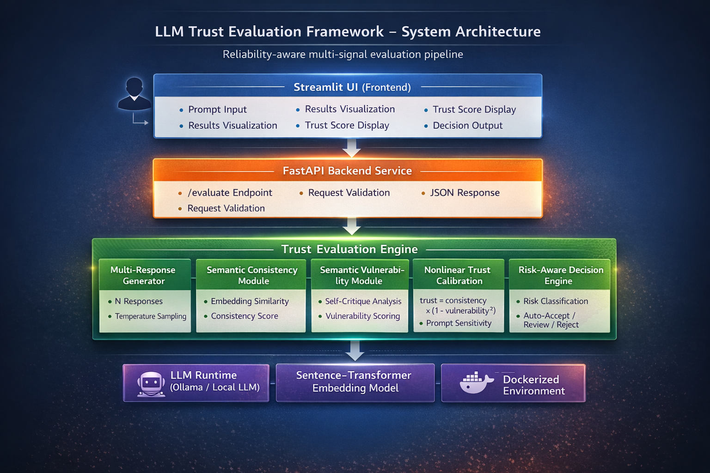

# 🧠 LLM Trust Evaluator  
### Reliability-Aware LLM Evaluation Framework


> A production-ready framework for evaluating LLM reliability using semantic consistency, nonlinear vulnerability calibration, and risk-aware decision logic.

---

## 🚀 Why This Project Exists

Large Language Models (LLMs) generate fluent responses — but fluency is not reliability.

Most applications:
- Use a single model response  
- Assume correctness  
- Ignore uncertainty  
- Ignore risk context  

This project addresses a critical question:

> **When should we trust an LLM’s answer?**

Instead of blindly trusting outputs, this system evaluates:

- Response stability  
- Semantic agreement  
- Self-identified vulnerability  
- Prompt sensitivity  
- Contextual risk level  

The result is a calibrated **trust score + decision policy**.

---

## 🏗 System Architecture



### Pipeline Overview
```
User Prompt
↓
Multi-Response LLM Generation
↓
Embedding-Based Consistency Analysis
↓
Self-Critique Generation
↓
Semantic Vulnerability Scoring
↓
Nonlinear Trust Calibration
↓
Risk Classification
↓
Decision: Auto-Accept | Review | Reject
```

---

## 🧩 Core Components

### 1️⃣ Multi-Response Stability Analysis

Instead of relying on a single LLM response:

- Generate N responses (temperature-controlled)
- Convert responses into embeddings
- Compute pairwise cosine similarity
- Derive a semantic consistency score

**Rationale:**  
If answers vary significantly, the model is unstable.

---

### 2️⃣ Semantic Vulnerability Detection

Rather than counting uncertainty keywords, this system:

- Generates a structured self-critique  
- Embeds critique text  
- Compares against vulnerability reference embeddings  
- Produces a semantic vulnerability score  

This detects:

- Assumptions  
- Missing context  
- Ambiguity  
- Reasoning weaknesses  

---

### 3️⃣ Nonlinear Trust Calibration

Trust is computed as:

```
trust = consistency × (1 - vulnerability²)
```

Why nonlinear?

- Small uncertainty → minimal penalty  
- Large vulnerability → strong penalty  

This reflects human-like risk sensitivity.

---

### 4️⃣ Prompt Sensitivity Analysis

The same question is rephrased and evaluated across variants.

Metrics:

- Mean trust  
- Standard deviation of trust  

Low variance → robust reasoning  
High variance → fragile behavior  

---

### 5️⃣ Risk-Aware Decision Engine

Trust alone is insufficient.

The system classifies prompts into risk categories:

- Low risk (educational, general knowledge)  
- High risk (medical, legal, financial)  

Decision logic:

| Risk | Trust | Decision |
|------|--------|----------|
| Low | > 0.7 | Auto-accept |
| Low | 0.4–0.7 | Review |
| High | Any | Review or Reject |

This prevents unsafe automation in high-stakes domains.

---

## 🖥 Demo Interface

.png)

The Streamlit UI allows users to:

- Enter any prompt  
- View multi-response outputs  
- Inspect consistency score  
- Inspect semantic vulnerability  
- View calibrated trust score  
- See final decision classification  

---

## 🛠 Tech Stack

- Python 3.10  
- FastAPI (backend service)  
- Streamlit (interactive UI)  
- Sentence-Transformers (semantic embeddings)  
- Scikit-learn (cosine similarity)  
- Ollama (local LLM inference)  
- Docker & Docker Compose (containerized deployment)  

---

## 🐳 Run with Docker

```bash
docker compose build --no-cache
docker compose up
```

**Streamlit UI:** http://localhost:8501

---

## 🔬 Example Output

```
Consistency: 0.91
Vulnerability: 0.23
Trust Score: 0.86
Risk Level: low
Decision: auto-accept
```
For medical dosage questions:
```
Risk Level: high
Decision: review
```

---

## 📈 Key Engineering Insights


*   Stability ≠ Correctness
    
*   Confidence ≠ Safety
    
*   Trust must be calibrated
    
*   Risk context must influence automation
    

This framework separates:

*   Model reliability
    
*   Uncertainty estimation
    
*   Deployment risk management

---  

## 🎯 Why This Matters


In production AI systems:

*   Blind trust is dangerous
    
*   Overly conservative systems are inefficient
    
*   Reliability must be measurable
    
*   Human-in-the-loop decisioning is essential
    

This project demonstrates:

*   ML system design
    
*   LLM evaluation strategy
    
*   Uncertainty modeling
    
*   Risk-aware deployment thinking
    
*   Production-grade API + containerization
    
---

## 🧠 Future Extensions


*   Train a learned vulnerability classifier
    
*   Bayesian trust calibration
    
*   Monte Carlo dropout uncertainty
    
*   Evaluation benchmark datasets
    
*   Logging & telemetry integration
    
*   CI/CD pipeline integration
    
---

## 📌 License

MIT License
